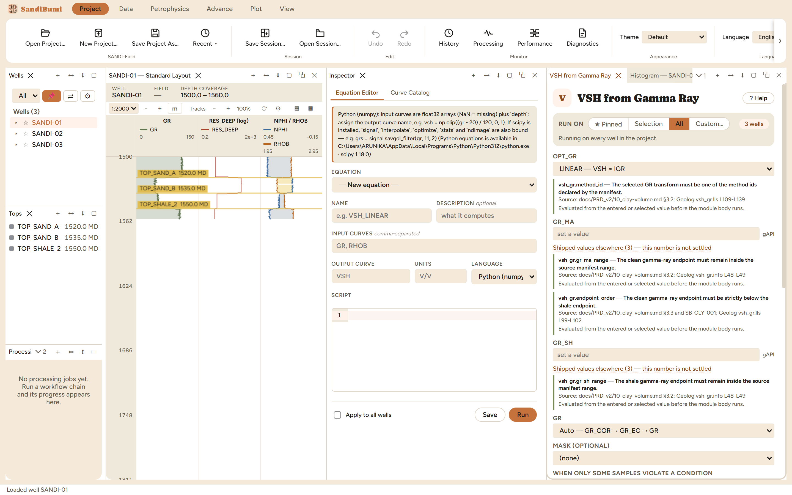
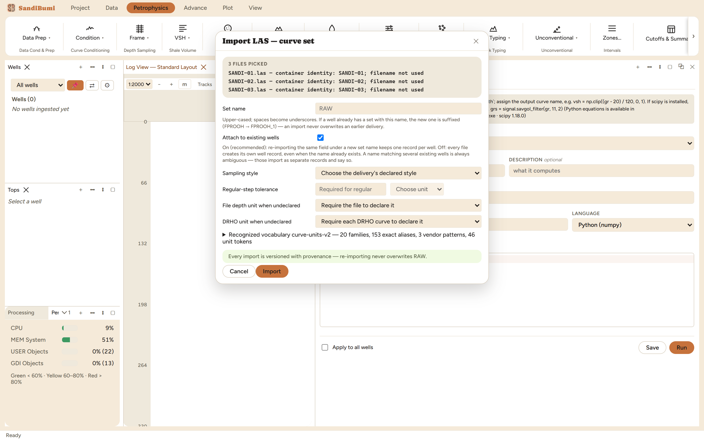
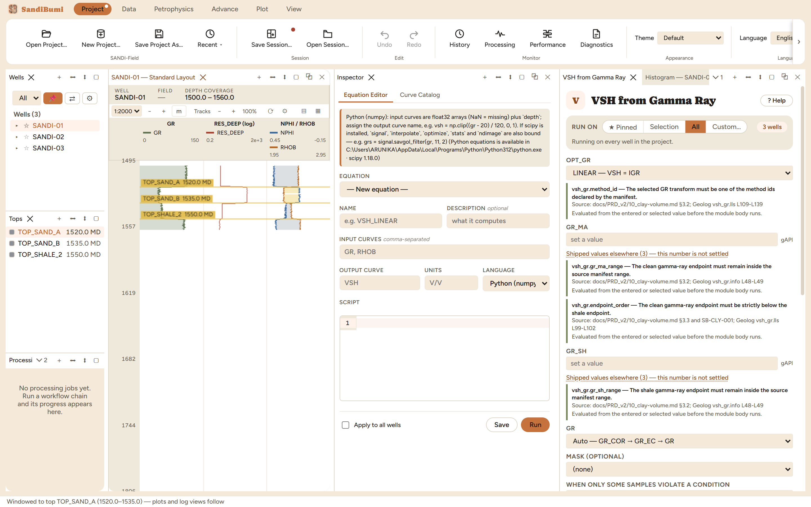
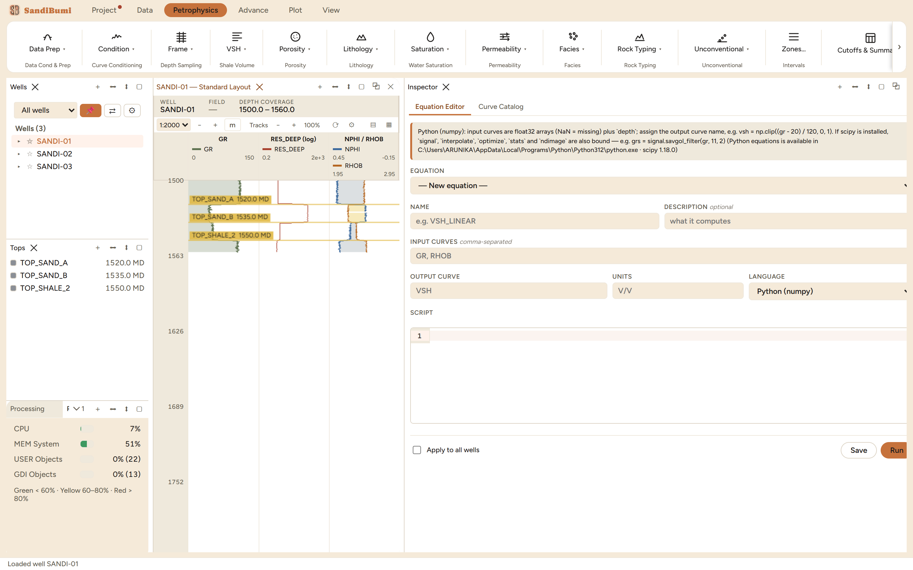
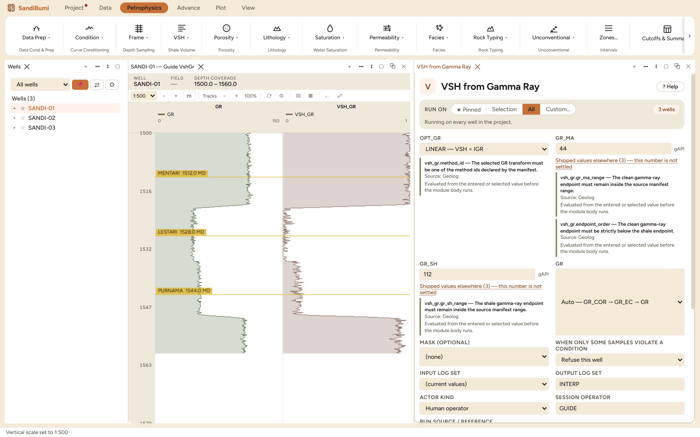
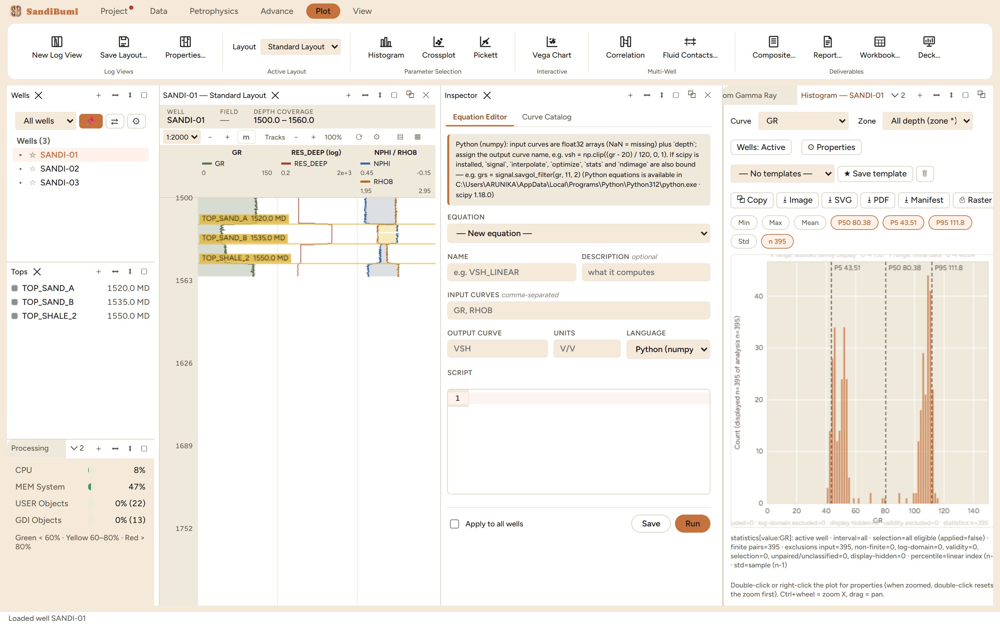
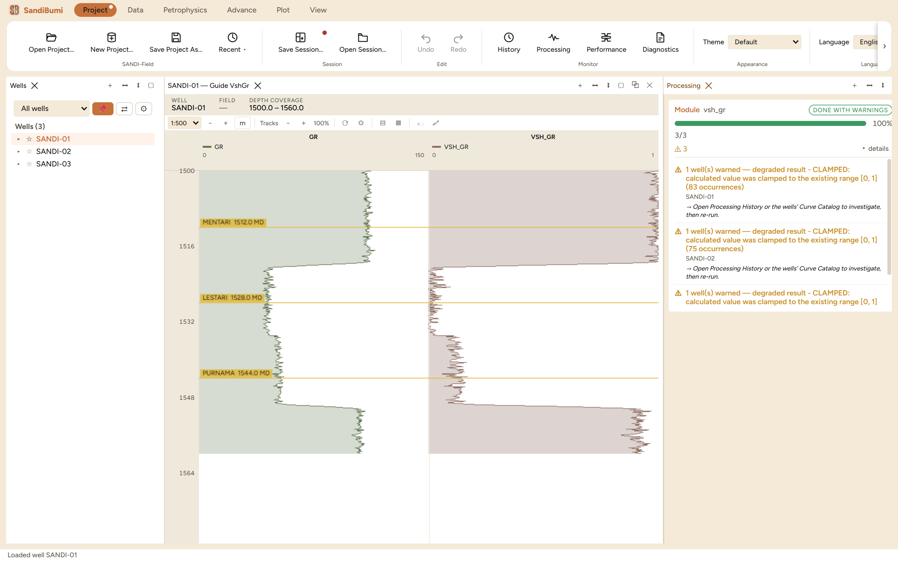
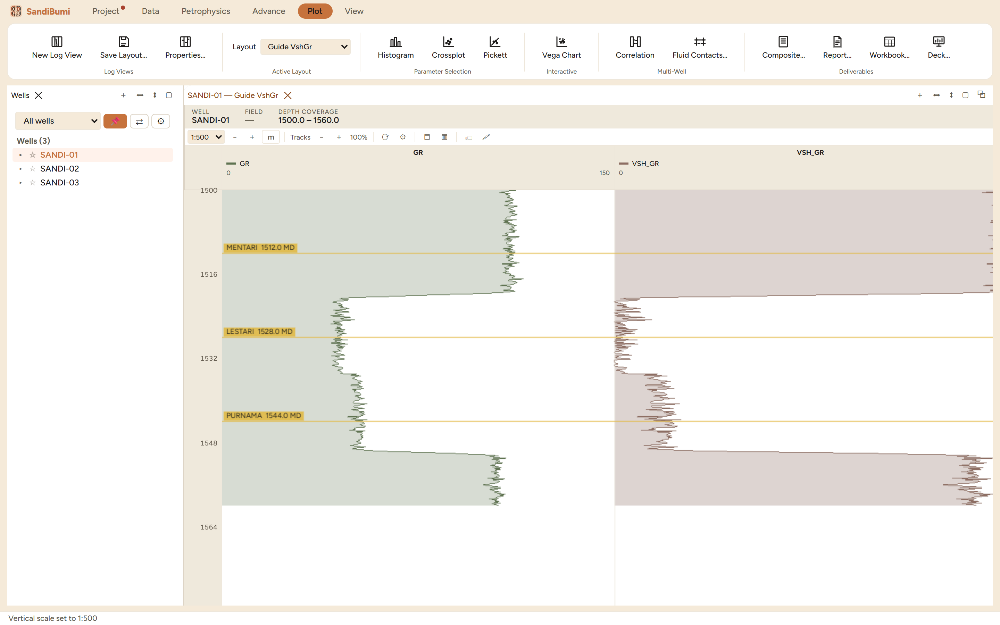
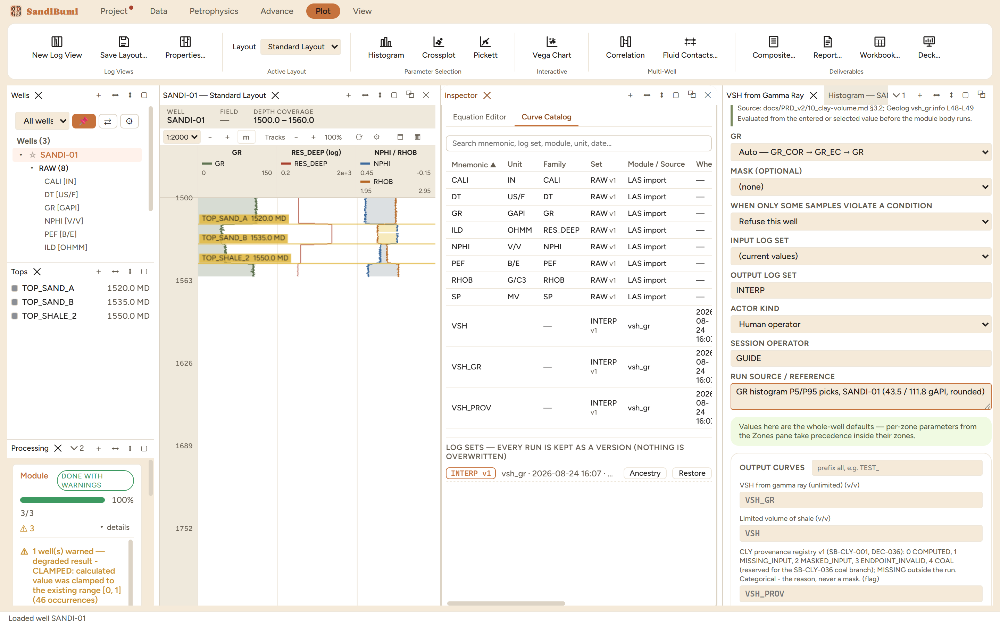
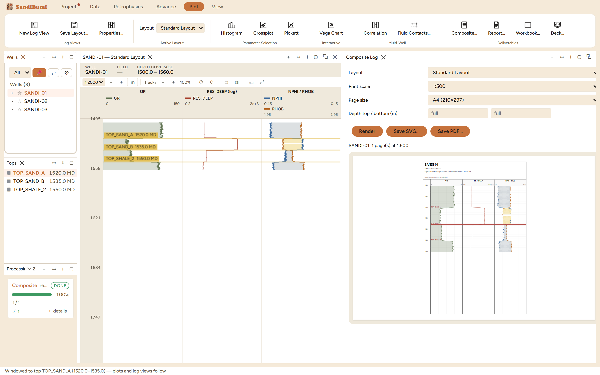

# SandiBumi — your first hour

This guide takes a petrophysicist from a fresh install to a finished one-well
interpretation, following one path. It is not a reference manual: each chapter does one
thing, in order, on the example dataset that ships in the repository
(`dataset for test/examples/` — three synthetic wells, **SANDI-01/02/03**, one shared
geology: a shale cap, a gas sand, a water sand, a base seal). Everything photographed
here is the real application driven through this exact flow.

**Setting up the machine is not this guide's job.** `CONTRIBUTING.md` §1–2 is the
install checklist, and `docs/INSTALLATION_PREREQUISITES.md` lists exactly which
capabilities need an optional Python package and what happens without it. The short
version: the core application — projects, LAS import, log views, plots, every Rust
petrophysics module, PDF/SVG export — needs **no Python at all**. Python (with numpy)
adds user-written equations; `dlisio` adds DLIS import; `scikit-learn` adds the ML
suite; Pillow adds picture imports beyond what the window itself can decode;
`xlsxwriter` / `python-docx` / `python-pptx` add the Excel / Word / PowerPoint
deliverables. A missing package fails only its own button, with a message naming the
interpreter and the pip command — never the application.

## The path

1. **Before you start** — what SandiBumi is, what is optional, and the example dataset.
2. **First launch and your project** — the app opens straight into a workspace; the
   Project tab owns New / Open / Save Project As / Recent, and the dot that means
   unsaved work.
3. **Import your first wells** — LAS import and the curve-set dialog: naming the
   delivery, attach, declaring the sampling style, and reading the import warnings.
4. **The Wells & Tops pane runs the workspace** — clicking a well or a top changes what
   every panel shows; the ▸ twisty lists each well's deliveries curve by curve.
5. **Reading the log view** — layouts, depth scale, tracks, the neutron-density
   crossover, and adding a track of your own.
6. **Run your first module** — shale volume from gamma ray, and the four mechanics
   every later run reuses.
7. **Where results live** — the Curve Catalog, log-set versions, Ancestry, the
   History — and why a module run is re-run, never undone.
8. **Export something** — a LAS file that reports what it wrote, and a print-scale
   composite page.
9. **Where to go next** — the Advance tab methods, per-panel Help, and the deeper
   documents in `docs/`.

---

## 1. Before you start

SandiBumi is a desktop application for petrophysical log analysis, built to hold a
whole field — the well count it is engineered for is in the thousands — while staying
responsive on an ordinary field laptop. One **project is one file** (a `.duckdb`
database): your wells, curves, tops, core data, computed results and their full history
travel together, and backing a study up means copying one file.

This guide works on the example dataset in `dataset for test/examples/`. Its
`README.md` is worth opening beside this guide: it describes each file, the ribbon path
that imports it, and what to expect — and the same three wells are what the project's
own automated tests parse, so if the app accepts a file there, it accepts your real
file of the same shape. The wells are synthetic but internally consistent (the core
porosities derive from the same density profile the LAS carries), so QC cross-checks
behave like a clean real delivery rather than random noise.

If you are unsure what optional capabilities your machine has, the **Project** tab's
**Prerequisites** button reports what the app found. *(Named gap: that dialog is not
photographed in this guide.)*

## 2. First launch and your project

There is no setup wizard. SandiBumi opens straight into a workspace: ribbon on top,
Wells and Tops panes on the left, a log view and Inspector in the middle, status bar at
the bottom. On the very first launch it opens (creating if necessary) a default
`project.duckdb`; from then on it reopens whatever project you used last. Your window
arrangement comes back too — closing the app and reopening it lands you where you
stopped.

The **Project** ribbon tab owns the project's lifecycle:

- **New Project… / Open Project… / Recent ▾** — switch projects; the group's caption
  shows which project is open now (here *SANDI-Field*). Start this guide by pressing
  **New Project…** and naming the file — ours is `SANDI-Field.duckdb`.
- **Save Project As…** — a full copy of the project file to a new location. Note what
  this is *not*: day-to-day saving. Imports, module runs and edits are written into the
  project as they happen; there is no "save your data" step to forget.
- **Save Session… / Open Session…** — a session is a named snapshot of the *workspace*
  (which panels are open, where, showing what), separate from the data. The red dot
  that appears on the Project tab marks unsaved session state — the arrangement, not
  your curves.
- **Undo / Redo** — for data and UI edits. Chapter 7 explains why module runs are
  deliberately not on this list.
- **Monitor group** (History / Processing / Performance / Diagnostics) — the
  application's own record of what it has done. You will meet History and Processing in
  chapters 6–7.
- **Theme** and **Language** — the appearance and UI language selects live here too.
  Technical terms stay in English in every language, by design.

## 3. Import your first wells

Imports live in the **Data** tab: **Import Logs ▾** (LAS, DLIS) and **Import Data ▾**
(core, SCAL, tops, pictures, deviation surveys, well locations). Choose **Import
LAS…**, multi-select the three example files `SANDI-01.las`, `SANDI-02.las`,
`SANDI-03.las`, and the curve-set dialog opens:

Four things happen here, and each is a statement about your data that SandiBumi
refuses to guess:

- **Which well is this?** The file rail at the top shows how each file identified
  itself — here the LAS header's own well name (*"container identity: SANDI-01;
  filename not used"*). File names are never trusted as well names.
- **Set name.** A delivery lands as a named curve set — leave it blank for **RAW**, the
  primary set. Re-importing never overwrites: a name already used on a well is suffixed
  (`FPROOH` → `FPROOH_1`), so an import can never eat an earlier delivery.
- **Attach to existing wells** (on by default) — a file whose well already exists in
  the project lands as a new set on that well record, instead of creating a duplicate
  well.
- **Sampling style is declared, never sniffed.** You state whether this delivery is
  continuous-regular or continuous-irregular; for regular, you also state the tolerance
  within which the step must verify. The dialog's own words: SandiBumi *"stores both
  the declaration and its verified effective style; it never infers regularity from the
  samples."* The example wells are exactly regular (0.1524 m step), so declare
  **Continuous regular** with any small tolerance — we used 0.001 m. On a real delivery
  the tolerance is your statement of how much step wobble still counts as regular.

Press **Import**. The **Processing** panel (bottom left) reports 3/3 done — with
warnings, and the warnings are worth reading once because they show the import's
honesty policy. On these files: *ILD* was recognised as the deep resistivity and
aliased to the RES_DEEP family, and several curves were **left in their declared
units** (SP in MV, ILD in OHMM, DT in US/F) because no reviewed conversion rule
applies — stated per curve rather than silently converted.

Then import the tops the same way: **Import Data ▾ → Import Tops…**,
`tops_multiwell.csv`. The file carries a WELL column, so its 9 tops route to all three
wells by name in one import — no well selection needed, and the result says exactly
where every row went.

Two details you would only notice later, surfaced now: each example well carries a
deliberate 1-metre gap in NPHI and PEF (a simulated washout) — you can see it in the
Curve Catalog as 388 of 395 valid samples — and the remaining example files (core,
SCAL, deviation, XRD…) follow the same probe-confirm-commit pattern; the dataset
README's table walks the full order when you want the complete little project.

## 4. The Wells & Tops pane runs the workspace

The Wells pane is not a list — it is the steering wheel. **Clicking a well loads it
everywhere at once**: the log view retitles to it, plots rebuild on it, and every
module pane's *Selection* scope means it. Click **SANDI-01** and the status bar
confirms *"Loaded well SANDI-01"*.

The **Tops** pane below does the same for depth. Click **TOP_SAND_A** and the status
bar states the mechanic in one line: *"Windowed to top TOP_SAND_A (1520.0–1535.0) —
plots and log views follow."* The interval runs from the clicked top down to the next
one; log views scroll to it, and plots gain an auto-selected zone option for it. This
is how you ask a histogram or crossplot about *one sand* instead of the whole well —
select the top, and the plots follow.

Three smaller controls on the Wells pane, for later:

- The **▸ twisty** on each well expands to its deliveries: each curve set, and inside
  it each curve with its unit (SANDI-01 ▸ RAW (8) ▸ GR [GAPI]…). This is the browser
  for *imported* data; *computed* results appear in the Curve Catalog (chapter 7).
- The **☆ star** pins wells into your working set — module panes can run on exactly
  the starred wells (the *Pinned* scope you will see in chapter 6).
- The **📌 button** on the group bar locks the active well, so a stray click in the
  tree cannot switch every panel while you are mid-interpretation.
- The **well-group select** ("All wells") filters the whole application to a named
  group of wells once you have one — useful from the tens of wells upward, ignorable
  today.

## 5. Reading the log view

The log view's header states what you are looking at — well, field, depth coverage —
and its toolbar owns the vertical presentation: the **depth scale** select (1:2000 down
to 1:200; the status bar confirms each change), depth-unit display, and track-width
controls. **Ctrl + scroll wheel zooms at the cursor; plain scroll pans.** The view
follows the selected well and the selected top, as chapter 4 showed.

What the default **Standard Layout** draws is deliberately conventional: GR with a
shading fill, deep resistivity on a log scale, and NPHI/RHOB together on compatible
scales with **crossover shading** — the yellow fill between the curves where they
cross is the classic gas-effect display, and you can see it light up inside SAND-A on
these wells.

A layout is a named thing, chosen in the **Plot** tab's *Layout* select, and edited
through **Plot → Properties…**: tracks are added, reordered and removed there, and
each track holds its curves with their scales, colours and fills. Chapter 6 ends by
adding a VSH track this way. One behaviour worth knowing before you invest effort:
**Properties… edits live in that panel** — press **Save Layout…** to keep an
arrangement as a named layout, or it stays with the panel it was made in (ours
vanished when we restarted the app without saving, which is exactly what unsaved
means).

## 6. Run your first module

You have three wells with GR, resistivity, neutron and density, and tops splitting them
into a shale cap, two sands and a base seal. The first interpretation step is the same
as it would be on paper: a shale volume from gamma ray. This chapter runs it, and on the
way meets the four mechanics every later module run reuses — where parameters come
from, who the run says it was run by, what "degraded" means, and where the output went.

### Open the module

Modules live in the **Petrophysics** ribbon tab, grouped the way you would group them
yourself: Data Prep, Condition, Frame, VSH, Porosity, Lithology, Saturation,
Permeability, Facies, Rock Typing, and so on. Click **VSH ▾ → VSH from Gamma Ray**.

It opens as a working pane docked beside your log view — not a popup — because you will
tune it while looking at the log. Every module pane in SandiBumi is built the same way,
generated from the module's own manifest, so once you can read this one you can read
all of them.

Reading the pane top to bottom:

- **RUN ON** — who gets computed. It opens on **All** ("Running on every well in the
  project", here 3 wells). **Selection** is the well you clicked in the Wells pane;
  **Pinned** is the wells you starred; **Custom…** is an explicit list. One run, many
  wells — that is the normal way to work, not a batch afterthought.
- **OPT_GR** — the GR-index transform (LINEAR here; the dropdown holds the nonlinear
  forms). Notice the text under it: every choice and every range check in this pane
  cites where it came from — a spec section, a reference implementation, line numbers.
  That is not decoration; it is the app telling you its defaults are sourced, not
  invented.
- **GR_MA and GR_SH have no default.** The clean-sand and shale gamma-ray endpoints are
  a property of *your* basin, and a number that ships pre-filled would be somebody
  else's calibration silently applied to your field. The link under each field —
  *"Shipped values elsewhere (3) — this number is not settled"* — shows where other
  installed tools carry values, precisely so you can see they disagree. You will supply
  these two numbers yourself, next.
- **GR** input — "Auto — GR_COR → GR_EC → GR" is the preference order: if a corrected
  gamma ray exists on the well it is used, otherwise the raw curve. You can pin a
  specific mnemonic instead.
- **MASK** — optionally name a flag curve (for example a bad-hole flag) and every
  flagged sample becomes missing in the output.
- **INPUT / OUTPUT LOG SET** — the run reads "(current values)" and writes into a named
  output set, **INTERP** by default. Chapter 7 shows what that buys you.
- The green callout is worth memorising: *"Values here are the whole-well defaults —
  per-zone parameters from the Zones pane take precedence inside their zones."* When
  you later give SAND-A its own endpoints, this pane's numbers keep governing everywhere
  else.

### Pick the endpoints from your own data

Where do GR_MA and GR_SH come from? From the histogram — the same place you would pick
them in any interpretation. Open **Plot → Histogram**; it builds for the selected well
and opens on GR.

SANDI-01's gamma ray is cleanly bimodal — sands on the left, shales on the right — and
the stat chips above the plot do the reading for you: **P5 = 43.5, P95 = 111.8 gAPI**,
drawn as dashed lines on the plot. We round to **GR_MA = 44** and **GR_SH = 112** and
type them into the pane. Percentile endpoints (rather than min/max) are a deliberate
choice with a visible consequence you will meet in a moment.

These numbers are picks from *this* dataset, made the way the guide shows so you can
repeat the method on your own field. They are not recommended values for anywhere.

### The run wants to know who and why

Press **Run VSH from Gamma Ray**. The first time, it refuses — in the pane, by name:

> Enter the session operator identity before computing.

Every run in SandiBumi is recorded with who ran it. Type your name or initials into
**Session operator**. Run again and it refuses once more:

> Enter the source/reference covering this run's explicit values.

You typed explicit numbers (44 and 112), so the run demands the reference that covers
them — the same discipline a reviewed study applies to every parameter. Our honest
citation is simply where the picks came from: `GR histogram P5/P95 picks, SANDI-01
(43.5 / 111.8 gAPI, rounded)`. This text is stored with the run and follows the output
curves; when someone asks in two years where 44 came from, the answer is attached to
the curve, not lost in a notebook.

### Read the outcome — "degraded" is the app being honest

Run again. The pane reports into the **Processing** panel and summarises:

> 0 clean · 3 degraded · 0 failed. Open Processing → details for the per-well report.

Expand **details** in the Processing panel. Each well says the same thing:

> degraded result - CLAMPED: calculated value was clamped to the existing range [0, 1]
> (46 occurrences)

This is the consequence of the P5/P95 pick, reported instead of hidden. SANDI-01's GR
actually spans 41.5–115.2 gAPI; every sample cleaner than 44 or shalier than 112
computes a GR index below 0 or above 1, and the limited output clamps it. About 46 of
395 samples — the tails the percentile pick deliberately excluded. "Degraded" never
means the run half-worked; it means the result carries a warning you should read once
and then either accept (as here — clamping at the endpoints is exactly what percentile
picks imply) or fix by re-running with different picks. A well that actually failed
says **failed**, and writes nothing.

### Where the answer went

The run wrote three curves per well into the **INTERP** output set — open the
Inspector's **Curve Catalog** tab to see them listed with the RAW curves:

- **VSH** — the limited volume of shale, 0 to 1. This is the interpretation.
- **VSH_GR** — the *unlimited* GR index (here −0.04 to 1.05). The apparent answer and
  the corrected answer get different names on purpose, so a report can never quote one
  as the other.
- **VSH_PROV** — a per-sample flag saying *why* each sample is what it is (computed,
  input missing, masked, endpoint invalid). Categorical — a reason, never a mask.

The catalog's log-set line states the storage rule in one breath: **every run is kept
as a version — nothing is overwritten**. Re-running with better endpoints writes
INTERP v2; v1 stays. That is why a module run is *re-runnable, not undoable*: undo is
for edits, while a run you disagree with is simply run again, and both versions remain
comparable. Each computed curve also carries an **Ancestry** action — the recorded
account of the module, inputs and parameters that produced it. *(Named gap: the
ancestry view itself is not yet walked through in this guide.)*

### Put VSH on the log

Seeing the number beside the rock is the point. With the log view active, open
**Plot → Properties…**, press **＋** to add a track, name it VSH, set its single curve's
mnemonic to `VSH` with a 0–1 scale, and OK.

At 1:500 the interpretation reads at a glance: VSH near zero through both sands, near
one in the shale cap and below TOP_SHALE_2, tracking the gamma ray it came from. The
Curve Catalog beside it shows the three INTERP v1 curves; the Processing panel still
holds the per-well report. If anything looks wrong, the pane you ran from is still
open — change a number and run again. That loop — pane, run, look, adjust — is how
every module in SandiBumi is meant to be worked.

One more habit worth forming now: click any pane and press the **? Help** button (in
the pane header, or Project → Help for the active panel). A module pane's help is the
module's own documentation, the same text its manifest carries.

## 7. Where results live

Everything the project holds about a curve is on display in one table: the Inspector's
**Curve Catalog** (also a button on the Data tab).

Each row carries the mnemonic, unit, family, **which set and version** it belongs to,
**which module or import produced it and when**, how many samples are valid out of how
many, and min / max / mean. Two different kinds of row are visible after chapter 6:
the RAW v1 rows from the LAS import, and the INTERP v1 rows stamped `vsh_gr` with
their run timestamp. A computed curve's **Ancestry** action holds the recorded account
of how it was made — module, inputs, parameters, and the reference you typed at run
time.

Below the table, the log-sets line makes the storage promise explicit: **"every run is
kept as a version — nothing is overwritten."** Each re-run of a module writes the next
version of its output set; earlier versions stay, listed and restorable. This is the
half of the mental model that replaces "undo": **Undo / Redo** (Project tab) reverses
*edits* — a curve you hand-edited, a top you moved, a value you changed in the
Database Inspector — while a module run you disagree with is not reversed but
*re-run*, and the versions sit side by side for comparison.

Two panels complete the record:

- **Processing** (Project → Monitor) shows live and recent jobs with per-well ✓/⚠/✗
  outcomes — this is where chapter 6's degraded report lived.
- **History** is the permanent operations log, kept in the project itself: imports,
  module runs ("Ran VSH from Gamma Ray on 3 wells"), project events, session saves —
  with an Export… button when you need the record outside the app.

And when something goes wrong on a machine far from you, **Project → Diagnostics**
builds a single plain-text file a user can read in full and then send — timings and
operation records, no well names, no paths, no curve values.

## 8. Export something

An interpretation that cannot leave the application is not finished. Two exports cover
the first hour; both live one click from the work.

**Export LAS** (Data tab, with a well selected) writes the well back out as LAS 2.0 —
standard curves and computed results together — and then tells you exactly what it
did. Exporting our SANDI-01 reports: 395 rows; 12 of 17 held curves written, the other
5 named individually with the reason (they were the RAW set's copies of curves already
written from the standard set — deduplicated, not lost); a precision statement (727
values reduced going from f32 storage to fixed-decimal LAS text); and a self-check in
which SandiBumi re-reads its own output before calling the export good. If a curve is
missing from an export, the report says so by name — silence is not an option it has.

**Composite Log** (Plot tab → Composite…) is the print deliverable: a log plot laid
out at a true printed scale, not a screenshot of the screen.

Pick the layout, the print scale (1:500 here), the page size and optionally a depth
window, then **Render** — the pane shows the paginated result ("SANDI-01: 1 page(s) at
1:500") with the title block carrying the well, layout, scale and interval. **Save
SVG…** writes vector graphics; **Save PDF…** writes a multi-page PDF with no external
dependencies. At 1:500 on A4, a metre of section is two millimetres on paper — the
scale means what it says.

The Plot tab's Deliverables group goes further — **Report…** (the full PDF study
document), **Workbook…** (Excel), **Deck…** (PowerPoint) — but those belong to a later
session; the office formats need their optional Python packages (chapter 1), and the
native PDF/SVG paths shown here never do.

## 9. Where to go next

The first hour ran one module on one log. The application widens from here in three
directions, and you have already learned the mechanics each one reuses.

**More of the same, deeper.** Every group in the Petrophysics tab — porosity,
lithology, saturation, permeability, facies, rock typing, cutoffs and summaries —
works exactly like chapter 6: a manifest-generated pane, cited parameters, custody,
versioned output. The **[module reference](reference/README.md)** has one page per
module — generated from the same manifests the panes are built from, so its
descriptions, defaults, sources and pre-run checks are exactly what the application
enforces. The example dataset's README lists the import order for core, SCAL,
deviation and the rest; with those loaded, the saturation-height tools and the
QC crossplots have real input. Zones (Petrophysics → Zones…) is where per-interval
parameters live — the green callout from chapter 6, made concrete.

**The Advance tab** holds the flagship in-house methods, promoted out of the generic
dropdowns: the **SSC / SSPW** sand-silt-clay methods, **RtC** and **IMTS**
low-resistivity saturation with their **Calibrate…** tools, **Thin Beds**, the
**SandiMin** multi-mineral solver, the **ML Models** suite, and the core-imaging and
petrography workbenches (core photos and photo logs, plate conditioning, pore-area
measurement, the mineral classifier, plug QC). Each is documented by its own pane's
**? Help**; the method mathematics is banked in `docs/` (`method_ssc_sspw.md`,
`method_lrlc_rtc_imts.md`, and the `record_*.md` build records).

**Many wells at once.** Everything you did on three wells was already multi-well — the
RUN ON pill, the tops that routed by well name. When the well count grows, the same
pattern scales through the Petrophysics → Batch tools: workflow chains (an ordered
module pipeline across the field), Monte Carlo uncertainty on top of a chain, and the
Field Dashboard that rolls the pay summary up per zone across every well. Those
deserve their own guide; the mechanics will already feel familiar.

Wherever you are in the application: click the pane, press **? Help**. And when the
answer is not there, the `docs/` folder of this repository is the deeper record — this
guide is the front door, not the whole house.
