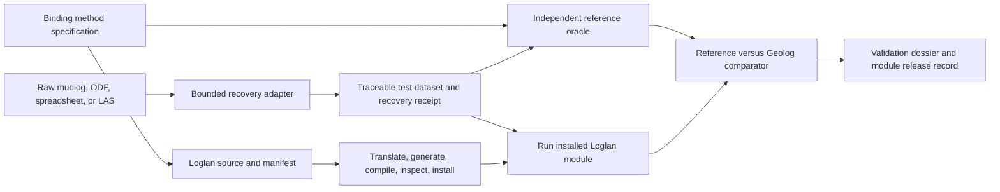

# Geolog Loglan module and wellsite-data laboratory design

**Date:** 2026-08-11

**Status:** Shortlist decision recorded; recommended design awaiting Jauhar's review

**Product owner:** Jauhar

**Nature:** Personal-first, local, non-commercial, and independent of SandiBumi, SegaraBumi, and
Clauding unless a later decision defines an explicit file-based seam

## 1. Decision recorded

The original exploration produced fifteen possible three-to-six-month Claude Code projects. Jauhar
rejected thirteen after applying the real product and human-judgment boundaries:

| # | Original option | Disposition | Boundary recorded from Jauhar |
|---:|---|---|---|
| 1 | Petrophysics Project Capsule and Forensics Workbench | OUT | Human judgment is preferred for the intended work |
| 2 | LAS/DLIS Delivery Auditor and Conservative Repair Lab | OUT | SegaraBumi already does this |
| 3 | Geolog Loglan Module Laboratory | **KEEP** | Selected for further design |
| 4 | Core-Log Integration Studio | OUT | SandiBumi already does this |
| 5 | Interpretation Validation Dossier Generator | OUT | SandiBumi already does this |
| 6 | Parameter and Method Provenance Registry | OUT | SandiBumi already does this |
| 7 | Mudlog/ODF Data Recovery Factory | **KEEP** | Selected for further design |
| 8 | Cross-Deliverable Consistency Reviewer | OUT | Not selected; no additional reason recorded |
| 9 | SCAL and Saturation-Height Workbench | OUT | SandiBumi already does this |
| 10 | LRLC/Thin-Bed Diagnostic Laboratory | OUT | SandiBumi already does this |
| 11 | Core and Depositional-Facies Atlas | OUT | The interpretation is subjective; not selected |
| 12 | Petrophysics Literature Evidence Studio | OUT | Not selected; no additional reason recorded |
| 13 | Method Comparator and Sensitivity Laboratory | OUT | Not selected; no additional reason recorded |
| 14 | Formation Tester-Core Permeability Reconciliation Lab | OUT | Not selected; no additional reason recorded |
| 15 | Synthetic-Log/ML Reliability Laboratory | OUT | Not selected; no additional reason recorded |

This record supersedes the broad fifteen-option menu for this personal build decision. Only options
3 and 7 remain in scope for design consideration.

## 2. Outcome

The preferred project is a **Geolog Loglan Module Laboratory** whose first bounded data-input lane
can use the existing mudlog/ODF recovery work.

The laboratory exists to turn a method that Jauhar has already selected and specified into a
traceable operational chain:

1. bind the method to its named specification and declared units;
2. implement an independent reference calculation;
3. implement the Loglan module;
4. translate, generate, compile, inspect and install it;
5. compare Loglan output with the reference output;
6. exercise it on representative real-well data; and
7. retain a validation record, install receipt, version and rollback path.

The mudlog/ODF lane is not a second general data platform. It is a bounded family of adapters that
recovers source-traceable wellsite data needed by the laboratory or by Jauhar's actual work.

## 3. Product boundary

This project is deliberately outside the three existing product roles:

| Product or system | Existing role | Boundary for this laboratory |
|---|---|---|
| SandiBumi | Deterministic petrophysical interpretation, visualization, validation and deliverables | The laboratory does not recreate its modules, UI, project database or interpretation workflows |
| SegaraBumi | Data discovery, indexing, intake and data-foundation work | The laboratory does not become a generic LAS/DLIS auditor, project indexer or search platform |
| Clauding | Durable knowledge, retrieval, literature and project evidence | The laboratory may cite local evidence but does not build another RAG or literature interface |
| Geolog | Runtime destination for approved operational modules | The laboratory builds, verifies, installs and versions modules used here |

No direct SandiBumi database integration is part of this design. Any later integration must begin
with a separately approved neutral file or manifest contract.

## 4. Three project shapes considered

### 4.1 Approach A - Loglan laboratory only

Build the module registry, reference oracle, build/install pipeline, comparator, real-well
regression and rollback system. Existing clean LAS or Geolog data supplies the tests.

**Advantage:** sharpest scope and strongest chance of a deeply verified module-engineering system.

**Cost:** difficult wellsite inputs remain a separate manual or script-based concern.

### 4.2 Approach B - Mudlog/ODF recovery factory only

Consolidate the existing numeric mudlog, legacy spreadsheet and ODF work under one adapter contract,
with immutable source intake, explicit recovery decisions, LAS output and reparse QC.

**Advantage:** fastest route to a dependable tool and highly suitable for bounded Claude Code work.

**Cost:** usage is episodic, and the long-term ceiling is lower once the formats Jauhar actually
receives are covered.

### 4.3 Approach C - Loglan flagship with bounded wellsite-data lane

Build Approach A as the flagship. Add only the recovery adapters justified by actual files needed
for its validation cases or Jauhar's recurring delivery work.

**Advantage:** creates one complete path from difficult source data to a numerically proven Geolog
module without turning either lane into a general platform.

**Cost:** scope discipline is harder. The recovery lane can consume the project if every vendor
exception is accepted without a real use case.

### Recommendation

**Approach C is recommended.** Option 3 remains the product identity and primary backlog. Option 7
is a plugin family and must not become a second flagship. If the first end-to-end Loglan validation
has not passed, expansion of the recovery-adapter catalogue stops.

## 5. System shape

The reference oracle and Loglan module share a binding specification, not source code. Agreement
between two implementations written in one model session is useful regression evidence, but is not
independent scientific validation by itself.

## 6. Components and ownership

### 6.1 Module registry

Each module record contains:

- stable module identity and version;
- purpose and applicability statement;
- binding source or project specification;
- declared input curves and units;
- declared outputs and units;
- parameter names, units and source requirements;
- Loglan source, generated metadata and build artifact identifiers;
- reference-oracle version;
- compilation, installation and validation state;
- known limitations, refusals and unresolved evidence;
- install receipt and rollback target; and
- supersession relationship where a newer version exists.

The registry uses an explicit state ladder:

1. `DRAFT` - source exists but no binding review has occurred;
2. `SOURCE-BOUND` - the governing specification, units and inputs are recorded;
3. `COMPILED` - expected build artifacts were inspected, not merely reported by a wrapper;
4. `INSTALLED` - the exact artifact is present at the intended Geolog location;
5. `SYNTHETIC-VERIFIED` - declared golden cases match the reference within stated numerical rules;
6. `REAL-WELL-VERIFIED` - representative real-well output has been reviewed and accepted by Jauhar;
7. `SUPERSEDED` - retained for provenance but no longer the current operational version; or
8. `REJECTED` - failed evidence or behavior is retained with the reason and is not operational.

No state is inferred from a later state name. A file can be installed without being numerically or
scientifically verified.

### 6.2 Build, install and rollback runner

The runner:

- diagnoses the required Geolog, compiler and environment configuration;
- validates the intended source and metadata files before building;
- runs translation and module generation;
- runs compilation;
- verifies that the expected binary and metadata artifacts exist and are current;
- installs only the exact inspected artifacts;
- records hashes, locations and timestamps in an installation receipt;
- preserves the prior installed version; and
- restores that prior version through an explicit rollback operation.

A zero wrapper exit code with a missing or stale executable is a build failure.

### 6.3 Independent reference oracle

The oracle is an executable implementation outside Loglan, expected to begin as a simple local
calculation library and runner. It:

- implements only a method whose binding specification is already approved;
- consumes explicitly named inputs and units;
- preserves missing-data behavior;
- exposes invalid-domain and refusal behavior;
- produces deterministic golden vectors;
- includes boundary and adversarial cases; and
- records the specification version used to produce each expectation.

Claude Code may implement the oracle, but Jauhar retains method selection, parameter sourcing, unit
approval, applicability and scientific acceptance. A Claude-generated oracle does not validate a
Claude-generated Loglan module merely by agreeing with it.

### 6.4 Loglan-reference comparator

The comparator reports rather than conceals:

- aligned input and output sample counts;
- depth and missing-value mismatches;
- finite-value difference by sample;
- maximum and distribution of finite differences;
- unexpected clipping, clamping or extrapolation;
- invalid-domain disagreement;
- unit and mnemonic mapping; and
- the exact module, oracle, data and specification versions compared.

A tolerance, where a method genuinely needs one, is not invented by the implementation. It is
derived from the numerical contract and documented before it becomes a pass/fail gate.

### 6.5 Wellsite-data recovery adapters

The initial adapter family is limited to source shapes already evidenced in Jauhar's work:

- numeric mudlog files;
- SDC Geo Suite ODF extraction;
- legacy spreadsheet/BIFF recovery;
- cumulative wellsite sections;
- gas-curve and lithology V/V QC where those channels exist; and
- traceable LAS output.

Numeric mudlog recovery and graphic/OCR lithology digitization remain separate modalities. Missing
TVD, lithology, cuttings or other channels are never fabricated. A new vendor adapter requires an
actual source file and a named recurring need; speculative format support is out.

### 6.6 Validation dossier

Every candidate module release produces a local dossier containing:

- module and oracle identities;
- binding source and unresolved evidence;
- build and installation receipts;
- golden-case results;
- real-well comparison where available;
- recovery receipt where an adapter supplied the data;
- deviations and manual decisions;
- known limitations; and
- current verification state.

The dossier is engineering evidence for Jauhar. It is not automatically a client deliverable or a
claim that the method is valid for another field.

## 7. Data and provenance contracts

- Source files are immutable. Recovery writes to a separate controlled output location.
- Every recovered output names its input files and records the transformations performed.
- Native depth samples are preserved unless an explicit, separately recorded operation changes the
  frame.
- Missing values remain missing; blank or absent data are never converted to zero for convenience.
- Units are declared and checked. An unknown unit is an unresolved input, not permission to infer.
- A project, analogue or literature value never becomes a default for another project.
- Client, field, well, operator, project and delivery identifiers never enter a committed fixture,
  comment, example or document.
- Real validation files remain outside the repository and are addressed through local configuration.
- A repair or merge is recoverable and followed by an independent reparse and QC comparison.
- An installed module retains its exact source, metadata, binary identity and prior rollback target.

## 8. Failure and refusal behavior

| Condition | Required behavior |
|---|---|
| File signature and extension disagree | Select a reader from inspected bytes where supported; otherwise refuse with evidence |
| Vendor channel meaning is unresolved | Preserve the channel unmapped and record the ambiguity |
| Recovery produces partial output | Report counts and affected sources; never present an unqualified clean success |
| Translation or compilation wrapper returns success but an artifact is missing or stale | Mark the build failed |
| Oracle and Loglan results disagree | Block promotion beyond the current verification state |
| Required unit, input, method parameter or source is absent | Refuse the affected calculation; never fill a default |
| Real-well evidence is unavailable | Keep `REAL-WELL-VERIFIED` open; synthetic cases cannot replace it |
| Geolog runtime is unavailable | Preserve completed source and oracle evidence; do not claim installation or runtime success |
| Same model authored both implementations | Require specification review and owned golden cases before acceptance |
| A new adapter has no actual recurring source case | Do not add it |

## 9. Verification model

### Automated evidence

- Parser fixtures pin file signatures, delimiters, headers, missing values and cumulative-section
  behavior.
- Round-trip tests reparse recovered LAS and compare inventory, sampling, values and missingness.
- Build tests inspect expected artifacts and metadata rather than trusting process status alone.
- Golden-vector tests compare the oracle and Loglan outputs against expectations derived from the
  binding specification.
- Negative tests prove that unknown units, missing inputs and invalid domains refuse rather than
  compute plausible output.
- Installation tests prove receipt creation, version preservation and rollback behavior.

### Human evidence

- Jauhar reviews the binding method and inputs before implementation is accepted.
- Jauhar inspects representative real-well overlays and consequential numerical differences.
- Jauhar alone marks a module `REAL-WELL-VERIFIED`.
- A fresh-context model review may find engineering defects, but it cannot substitute for source or
  real-well evidence.

The number of generated modules is not a success metric. One end-to-end verified module is a
stronger result than a catalogue of compiled but unproven modules.

## 10. Six-month sequence

### Month 1 - Inventory and contracts

- Consolidate pointers to the existing Loglan sources, reference material, build knowledge and
  recovery assets without moving client data into the repository.
- Define the module manifest and verification-state schema.
- Select the first module family and representative validation data through a separate Jauhar
  decision.
- Record the binding source, units, expected behavior and refusals before implementation.

### Month 2 - Build, installation and rollback

- Implement environment diagnosis.
- Implement translation, generation, compilation and artifact inspection.
- Implement controlled installation, receipts, version preservation and rollback.
- Exercise failure paths with non-scientific test modules before trusting the runner with a method.

### Month 3 - Oracle and golden vectors

- Implement the first approved reference calculation.
- Create sourced golden, boundary, missing-input and invalid-domain cases.
- Implement the Loglan-reference comparator.
- Stop if the binding specification cannot support independent expectations.

### Month 4 - Bounded wellsite-data lane

- Bring only the required existing mudlog/ODF recovery path under the common adapter contract.
- Produce immutable-source receipts, clean outputs and reparse QC.
- Add no format lacking an actual source case.

### Month 5 - End-to-end representative run

- Recover or select the representative input data.
- Run the oracle and installed Loglan module on the same declared basis.
- Compare values, missingness, boundaries, units and depth behavior.
- Record defects without changing the binding method merely to force agreement.

### Month 6 - Hardening and reusable release

- Resolve engineering defects found by the representative run.
- Repeat the exact validation from a clean controlled setup.
- Freeze the verified module, oracle, receipts, dossier and rollback package.
- Add a second module only if the first end-to-end gate is genuinely closed.

## 11. Claude Code operating model

Claude Code is used heavily where work is independently checkable:

- adapter and parser implementation;
- hostile fixtures and negative tests;
- manifest, registry and receipt mechanics;
- build-environment diagnosis and wrappers;
- source-to-oracle and source-to-Loglan implementation after the specification is fixed;
- comparator, report and documentation work;
- code review, failure-path analysis and regression expansion; and
- packaging and rollback mechanics.

Claude Code does not own:

- method selection;
- petrophysical parameters, endpoints, cutoffs or calibration values;
- source adjudication;
- unit or depth-reference decisions not already specified;
- whether a method applies to a well or field;
- final real-well acceptance; or
- the decision to transfer an output into SandiBumi, SegaraBumi or a client workflow.

Subscription use is measured by accepted durable assets and closed verification gaps, not by tokens
consumed or source lines generated.

## 12. Explicit non-goals

- No generic LAS/DLIS viewer or auditor.
- No project indexer, search engine or RAG.
- No general petrophysical interpretation platform.
- No automatic method or parameter selection.
- No replacement for SandiBumi modules or deliverables.
- No direct SandiBumi or SegaraBumi database writes.
- No promise to support every mudlogging or wellsite vendor.
- No cloud service, accounts, synchronization or telemetry.
- No multi-user permission system.
- No commercial licensing or marketplace in the first goal.
- No UI-first desktop shell before the command-line and evidence workflow is proven.
- No success claim based only on generated source, compilation, installation or synthetic data.

## 13. Success criteria for the first personal release

- At least one Jauhar-selected module has an approved binding specification.
- The exact module translates, generates, compiles, installs and rolls back reproducibly.
- Its external oracle and Loglan outputs agree under the documented numerical contract for owned
  golden cases.
- Missing input, unknown unit and invalid-domain cases refuse visibly.
- A representative real-well comparison is retained and reviewed by Jauhar.
- Any wellsite recovery adapter used in that comparison produces a source-linked receipt and passes
  reparse QC.
- The release record distinguishes synthetic, automated and real-well evidence.
- No client identifier, client-fitted default or confidential source file enters the repository.

## 14. Decisions deliberately left open

The following are not inferred by this document:

- final choice among Approach A, B or the recommended C;
- permanent project name and repository location;
- implementation language and user-interface stack;
- the first module family;
- the first representative real-well corpus;
- the exact initial ODF, mudlog and spreadsheet source shapes;
- numeric comparison rules for the first method;
- whether the recovery lane ships in the same repository or behind a neutral plugin boundary; and
- any later integration with SandiBumi or SegaraBumi.

## 15. Review and authorization boundary

Approval of this document authorizes writing a detailed implementation plan for the selected
approach. It does not authorize production code, a new repository, installation changes, a
petrophysical equation, a parameter value, import of confidential data, a SandiBumi/SegaraBumi
integration, a branch merge or a commercial claim.
